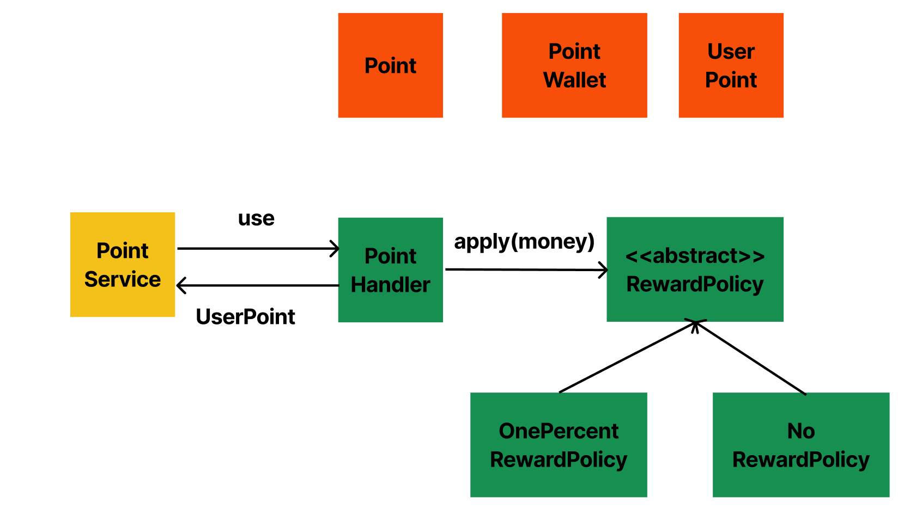
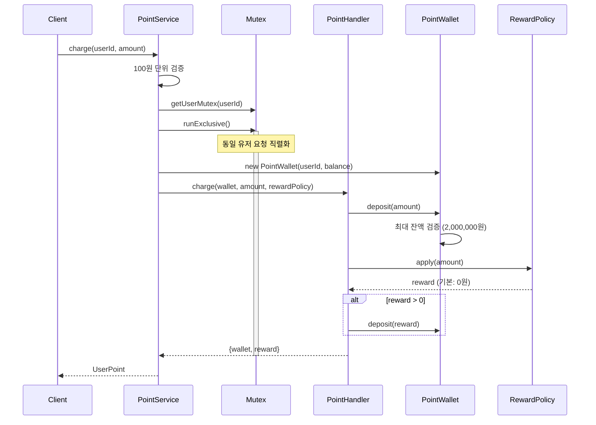
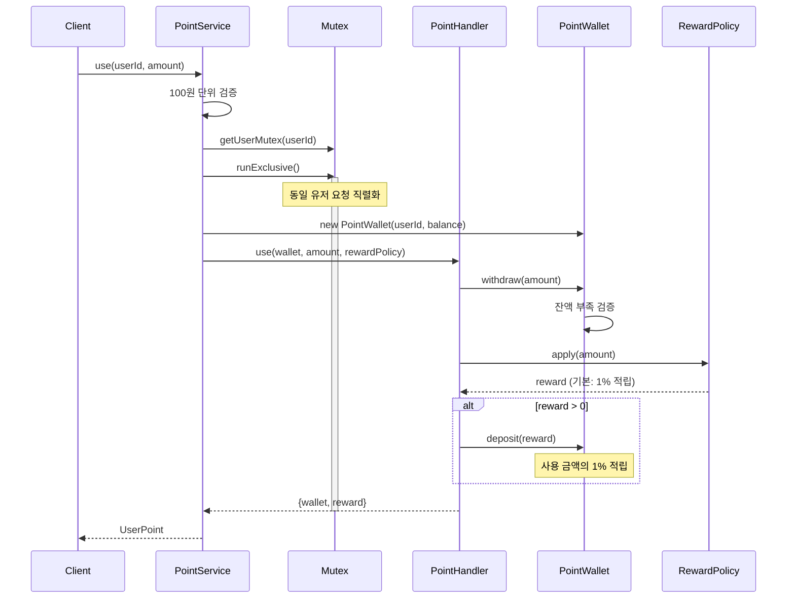
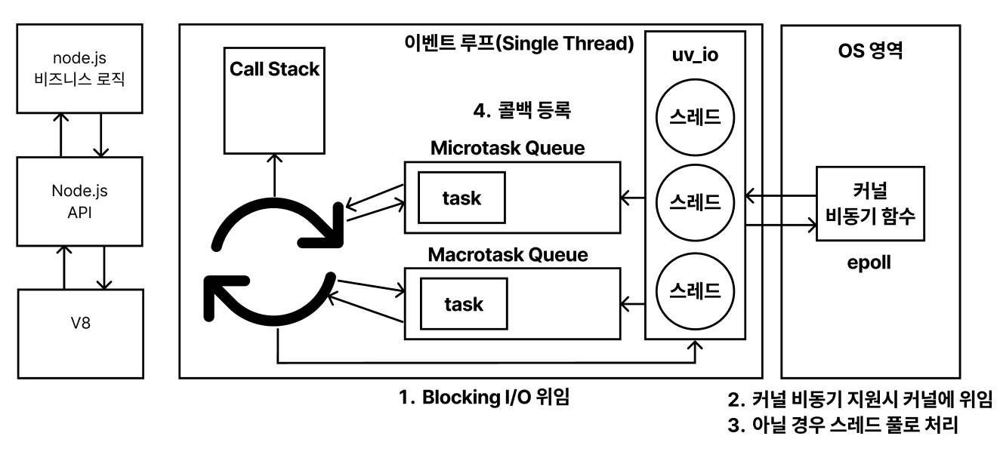
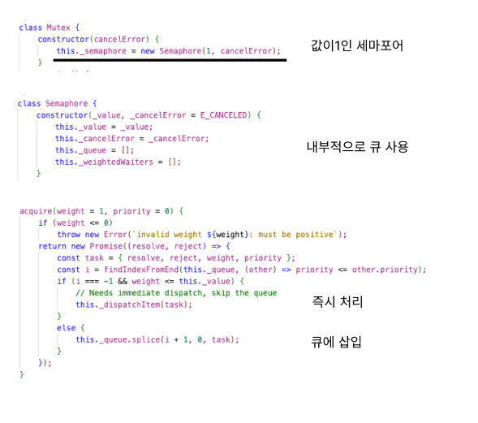
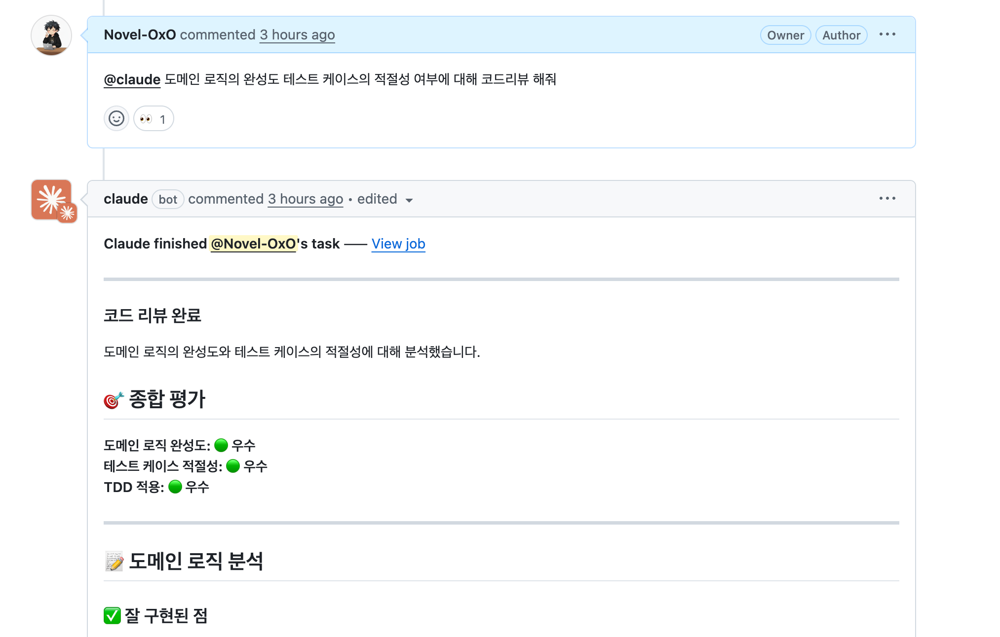

## 항해 플러스 포인트 관리 시스템

### Overall Class Diagarm

### 충전 시퀀스 다이어그램

### 포인트 사용 시퀀스 다이어그램

### 직접 추가하는 요구사항

1. **포인트 충전/사용 금액의 단위 제한**
   - 포인트는 100원 단위로만 충전/사용 가능

2. **포인트 사용시 적립**
   - 포인트 사용시 사용 금액의 1%를 포인트로 적립

3. **잔액 한도 제한**
   - 포인트 잔액 최대 한도 제한: 2,000,000원

### 동시성 문제 해결 방안에 앞서

저는 주로 Java를 사용하여 개발을 해 왔고, **Node.js는 싱글스레드로 알고 있는데 왜 동시성 문제가 발생할까?** 라는 궁금증이 생겼습니다.

**Node.js 비동기 작업**

- Node.js에서 비동기 작업은 libuv에 위임됩니다.
- libuv는 해당 연산을 커널에서 지원 할 경우 커널에 위임 합니다. (ex) Non Blocking I/O Epoll)
- 커널에서 연산을 지원 하지 않을 경우 별도의 스레드 풀에서 처리합니다.
- **즉 비동기 작업은 별도의 스레드 풀에서 처리되기 때문에 외부 리소스를 사용할 경우 동시성 문제가 발생할 수 있습니다.**

### 동시성 문제 해결 방안

#### 선택한 방식: 유저별 Mutex (async-mutex)

**배경**  
  
Node.js는 싱글 스레드 이벤트 루프 모델로 동작하며, 일반적인 비동기 작업 동기화를 위한 내장 뮤텍스나 세마포어가 없습니다. (Worker Threads를 위한 Atomics는 존재하지만 일반적인 비동기 작업 동기화에는 적합하지 않음)

서드파티 라이브러리들(async-mutex 등)은 내부적으로 Promise 기반의 대기 큐를 사용하여 뮤텍스를 구현합니다. 결과적으로 애플리케이션 레벨에서 큐 기반 동기화를 사용하는 것 외에는 대안이 없었습니다.

**고려한 대안**

1. **전역 큐를 통한 요청 직렬화**
   - 모든 요청을 단일 큐에서 순차 처리
2. **유저별 Mutex**
   - 각 유저마다 독립적인 락을 사용하여 동시성 제어

**Mutex를 선택한 이유**

1. **성능**: 다른 유저의 요청은 병렬로 처리 가능
   - **전역 큐**: 모든 요청이 순차 처리 → 전체 처리량 낮음
   - **유저별 Mutex**: 동일 유저 요청만 직렬화 → 전체 처리량 높음

2. **확장성**: 유저 수가 증가해도 성능 저하 없음
   - **전역 큐**: 유저 수 증가 시 대기 시간 선형 증가
   - **유저별 Mutex**: 각 유저가 독립적으로 처리됨

3. **구현 복잡도**: 코드가 간결하고 유지보수 용이
   - `async-mutex` 라이브러리로 간단히 구현
   - `runExclusive()` 메서드로 락 획득/해제 자동 관리

4. **실제 요구사항에 부합**: "동일한 사용자"에 대한 동시성 제어가 목적
   - 서로 다른 유저의 요청을 막을 이유가 없음

**trade-off**

- **메모리**: 유저별 Mutex 객체를 Map에 유지해야 하며, 유저 수에 비례하여 메모리 사용량 증가
- **관리 복잡도**: 유저별 Mutex 생명주기 관리 필요 (TTL, 정리 로직 등)

### AI 활용

- Claude Code를 이용한 코드리뷰
- Custom Commands를 이용한 워크 플로우 자동화
