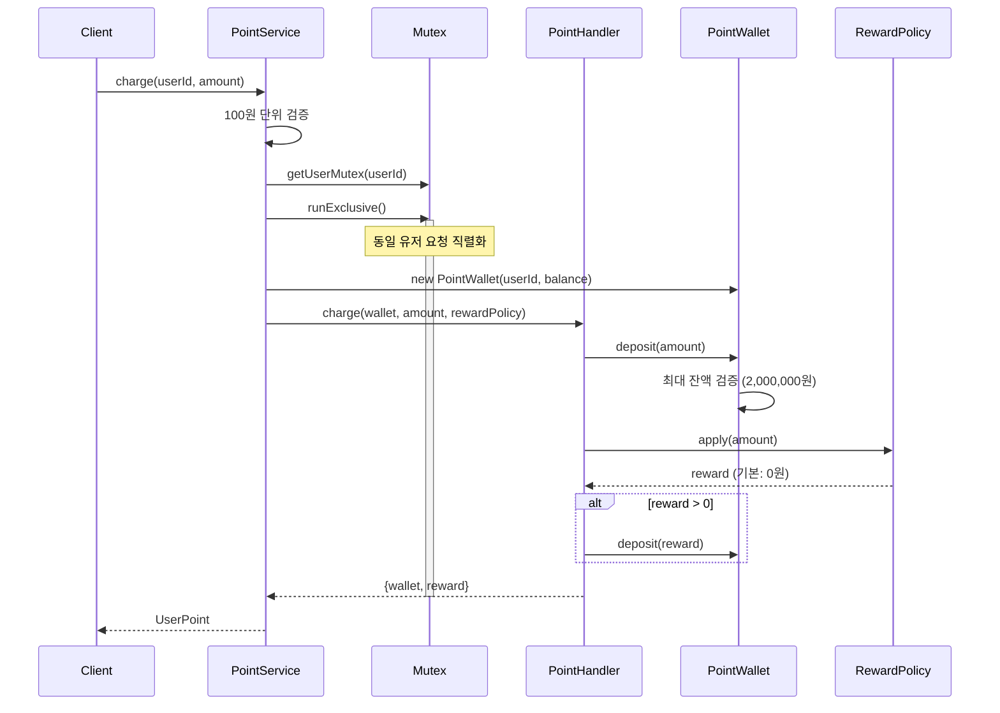
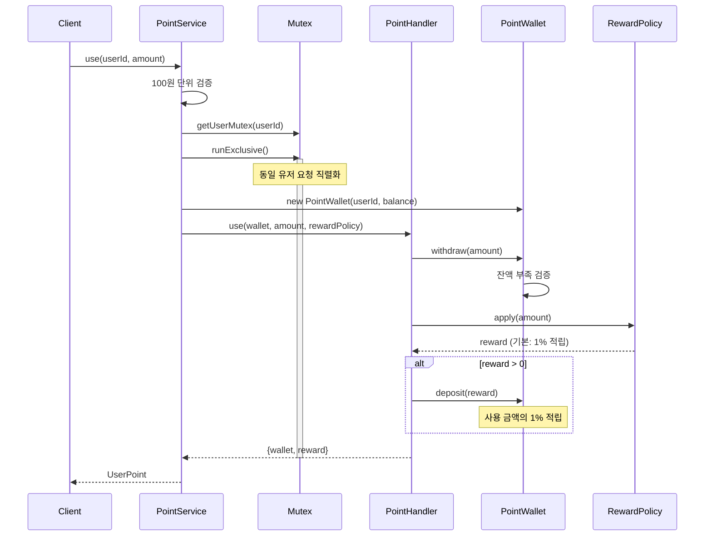

## 항해 플러스 포인트 관리 시스템

### Overall Class Diagarm

### 충전 시퀀스 다이어그램

### 포인트 사용 시퀀스 다이어그램

### 직접 추가하는 요구사항

1. **포인트 충전/사용 금액의 단위 제한**
   - 포인트는 100원 단위로만 충전/사용 가능

2. **포인트 사용시 적립**
   - 포인트 사용시 사용 금액의 1%를 포인트로 적립

3. **잔액 한도 제한**
   - 포인트 잔액 최대 한도 제한: 2,000,000원

### 동시성 문제 해결 방안

#### 선택한 방식: 유저별 Mutex (async-mutex)

**고려한 대안**

1. **인메모리 큐를 통한 요청 직렬화**: 모든 요청을 단일 큐에서 순차 처리
2. **유저별 Mutex**: 각 유저마다 독립적인 락을 사용하여 동시성 제어

**Mutex를 선택한 이유:**

1. **성능**: 다른 유저의 요청은 병렬로 처리 가능
   - 큐 방식: 모든 요청이 순차 처리 → 전체 처리량 낮음
   - Mutex 방식: 동일 유저 요청만 직렬화 → 전체 처리량 높음

2. **확장성**: 유저 수가 증가해도 성능 저하 없음
   - 큐 방식: 유저 수 증가 시 대기 시간 선형 증가
   - Mutex 방식: 각 유저 독립적으로 처리

3. **구현 복잡도**: 코드가 간결하고 유지보수 용이
   - `async-mutex` 라이브러리로 간단히 구현
   - `runExclusive()` 메서드로 락 획득/해제 자동 관리

4. **실제 요구사항에 부합**: "동일한 사용자"에 대한 동시성 제어가 목적
   - 서로 다른 유저의 요청을 막을 이유가 없음

**trade-off**

- 메모리: 유저별 Mutex 객체 유지 필요 (Map 구조)

### AI 활용

- Claude Code를 이용한 코드리뷰
- Custom Commands를 이용한 워크 플로우 자동화
- `Claude.md` 파일은 개인적인 선호에 맞지 않아 사용하지 않았습니다.
